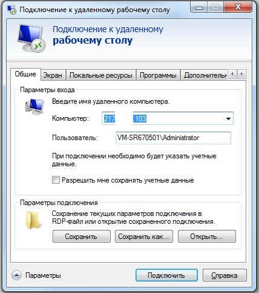
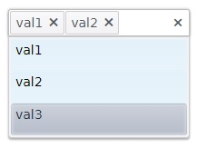

# Содержание
- [Содержание](#содержание)
- [Разворачивание системы](#разворачивание-системы)
	- [Подключение к серверу](#подключение-к-серверу)
	- [Разворачивание базы данных (БД)](#разворачивание-базы-данных-бд)
	- [Разворачивание сайта в IIS](#разворачивание-сайта-в-iis)
- [Администрирование системы](#администрирование-системы)
	- [Меню администрирования](#меню-администрирования)
	- [Конфигурация системы](#конфигурация-системы)
		- [Описание](#описание)
		- [JSON](#json)
	- [Настройка уведомлений](#настройка-уведомлений)
		- [Описание](#описание-1)
		- [JSON](#json-1)
		- [Скрин](#скрин)
	- [Настройка пользователей](#настройка-пользователей)
		- [Создание](#создание)
	- [Настройка ролей](#настройка-ролей)
		- [Создание](#создание-1)
		- [Настройка](#настройка)
			- [JSON](#json-2)
			- [Скрин](#скрин-1)
	- [Настройка форм](#настройка-форм)
		- [Создание](#создание-2)
		- [Настройка](#настройка-1)
			- [JSON](#json-3)
- [Основные компоненты](#основные-компоненты)
	- [Button / Кнопка](#button--кнопка)
		- [Свойства компонента](#свойства-компонента)
		- [Пример](#пример)
			- [JSON](#json-4)
			- [Скрин](#скрин-2)
	- [Chart / График](#chart--график)
		- [Свойства компонента](#свойства-компонента-1)
		- [Пример](#пример-1)
			- [JSON](#json-5)
			- [Скрин](#скрин-3)
	- [Checkbox / Чекбокс](#checkbox--чекбокс)
		- [Свойства компонента](#свойства-компонента-2)
		- [Пример](#пример-2)
			- [JSON](#json-6)
			- [Скрин](#скрин-4)
	- [Colorpicker / Палитра цветов](#colorpicker--палитра-цветов)
		- [Свойства компонента](#свойства-компонента-3)
		- [Пример](#пример-3)
			- [JSON](#json-7)
			- [Скрин](#скрин-5)
	- [Date / Выбор даты](#date--выбор-даты)
		- [Свойства компонента](#свойства-компонента-4)
		- [Пример](#пример-4)
			- [JSON](#json-8)
			- [Скрин](#скрин-6)
	- [DropList / Выпадающий список](#droplist--выпадающий-список)
		- [Свойства компонента](#свойства-компонента-5)
		- [Пример](#пример-5)
			- [JSON](#json-9)
			- [Скрин](#скрин-7)
	- [File / Файл](#file--файл)
		- [Свойства компонента](#свойства-компонента-6)
		- [Пример](#пример-6)
			- [JSON](#json-10)
			- [Скрин](#скрин-8)
	- [Grid / Таблица](#grid--таблица)
		- [Свойства компонента](#свойства-компонента-7)
		- [Пример](#пример-7)
			- [JSON](#json-11)
			- [Скрин](#скрин-9)
	- [Import / Импорт Excel файла](#import--импорт-excel-файла)
		- [Свойства компонента](#свойства-компонента-8)
		- [Пример](#пример-8)
			- [JSON](#json-12)
			- [Скрин](#скрин-10)
	- [Label / Текст](#label--текст)
		- [Свойства компонента](#свойства-компонента-9)
		- [Пример](#пример-9)
			- [JSON](#json-13)
			- [Скрин](#скрин-11)
	- [List / Выпадающий список](#list--выпадающий-список)
		- [Свойства компонента](#свойства-компонента-10)
		- [Пример](#пример-10)
			- [JSON](#json-14)
			- [Скрин](#скрин-12)
	- [MaskedText / Ввод текста по маске](#maskedtext--ввод-текста-по-маске)
		- [Свойства компонента](#свойства-компонента-11)
			- [Маска текста](#маска-текста)
		- [Пример](#пример-11)
			- [JSON](#json-15)
			- [Скрин](#скрин-13)
	- [MultiSelect / Выпадающий список с множественным выбором](#multiselect--выпадающий-список-с-множественным-выбором)
		- [Свойства компонента](#свойства-компонента-12)
		- [Пример](#пример-12)
			- [JSON](#json-16)
			- [Скрин](#скрин-14)
	- [Multitext / Мультистрочный ввод текста](#multitext--мультистрочный-ввод-текста)
		- [Свойства компонента](#свойства-компонента-13)
		- [Пример](#пример-13)
			- [JSON](#json-17)
			- [Скрин](#скрин-15)
	- [NumericText / Ввод числового текста](#numerictext--ввод-числового-текста)
		- [Свойства компонента](#свойства-компонента-14)
		- [Пример](#пример-14)
			- [JSON](#json-18)
			- [Скрин](#скрин-16)
	- [Panel / Панель](#panel--панель)
		- [Свойства компонента](#свойства-компонента-15)
		- [Пример](#пример-15)
			- [JSON](#json-19)
	- [PostIndicate / Индикатор запроса](#postindicate--индикатор-запроса)
		- [Свойства компонента](#свойства-компонента-16)
		- [Пример](#пример-16)
			- [JSON](#json-20)
			- [Скрин](#скрин-17)
	- [Query / Запрос](#query--запрос)
		- [Свойства компонента](#свойства-компонента-17)
		- [Пример](#пример-17)
			- [JSON](#json-21)
	- [Report / Формирование Excel отчета](#report--формирование-excel-отчета)
		- [Свойства компонента](#свойства-компонента-18)
		- [Пример](#пример-18)
			- [JSON](#json-22)
			- [Скрин](#скрин-18)
	- [Splitter / Сплиттер](#splitter--сплиттер)
		- [Свойства компонента](#свойства-компонента-19)
		- [Пример](#пример-19)
			- [JSON](#json-23)
			- [Скрин](#скрин-19)
	- [SplitterPane / Панель сплиттера](#splitterpane--панель-сплиттера)
		- [Свойства компонента](#свойства-компонента-20)
		- [Пример](#пример-20)
			- [JSON](#json-24)
	- [Text / Ввод текста](#text--ввод-текста)
		- [Свойства компонента](#свойства-компонента-21)
		- [Пример](#пример-21)
			- [JSON](#json-25)
			- [Скрин](#скрин-20)
	- [Tree / Дерево](#tree--дерево)
		- [Свойства компонента](#свойства-компонента-22)
		- [Пример](#пример-22)
			- [JSON](#json-26)
			- [Скрин](#скрин-21)
	- [Window / Модальное окно](#window--модальное-окно)
		- [Свойства компонента](#свойства-компонента-23)
		- [Пример](#пример-23)
			- [JSON](#json-27)
			- [Скрин](#скрин-22)
# Разворачивание системы
## Подключение к серверу
1. Открыть Подключение к удаленному рабочему столу (RDP)
   * Открыть «Выполнить (Run)» (Win + R)
   * Ввести команду «mstsc»
	<br>
2. Подключиться к удаленной машине:
   * Ввести адрес удаленной машины
   * Ввести учетные данные для авторизации (домен/логин и пароль)
   <br>
## Разворачивание базы данных (БД)
1. Скопировать бекап БД «ibs_norm.bak» на сервер
2. Подключится к MS SQL Server, например, через SQL Server Management Studio
3. Включить режим смешанной проверки подлинности (необходим для корректной работы сайта):
   * Открыть свойства сервера
   * Перейти во вкладку «Security»
   * В блоке «Server authentication» установить значение «SQL Server and Windows Authentication mode»
	<br>
   * Задать пароль для пользователя «sa»:
     * Перейти в «Security - Logins» и зайти в свойства пользователя «sa»
     * Задать пароль «system!1» и отключить устаревание пароля
	<br>
   * Перезагрузить сервер MS SQL Server
   * Проверить возможность подключения к серверу под пользователем «sa»
4. Развернуть бекап БД (если БД «ibs_norm» уже существует, необходимо предварительно удалить её):
   * Выделить папку «Database»:
     * Вызвать контекстное меню
     * Выбрать «Restore Database»
	<br>
   * General
     * Source
       * Device
         * Нажать на «Add» и выбрать скопированный ранее бекап
		<br>
   * Убедиться что БД появилась в списке баз в папке «Databases»
<br>
___
## Разворачивание сайта в IIS
1. Скопировать архив «PK5_v2.zip» с сайтом на сервер
2. Запустить Internet Information Services (IIS) сервер, например, через меню «Выполнить»:
   * Открыть «Выполнить (Run)» (Win + R)
   * Ввести команду «inetmgr»
<br>
3. Создать новый пул приложений (если пул «ibs_norm» уже существует, необходимо предварительно переименовать или удалить его):
   * Имя пула – «ibs_norm»
   * Версия среды .Net Framework – «v4.0»
   * Режим управляемого конвейера – «встроенный»
<br>
4. Создать новый сайт (если сайт «ibs_norm» уже существует, необходимо удалить его; если существует другой сайт на 80 порту, необходимо изменить его порт):
   * Выделить строку с сервером
   * Вызвать контекстное меню
     * Добавить веб-сайт:
     * Имя сайта – «ibs_norm»
     * Пул приложений – «ibs_norm»
     * Выбрать физический путь к сайту (при необходимости создать новую папку)
    	> Например, «C:\Sites\ibs_norm»
     * Порт – «80»
     * Снять флажок «Запустить веб-сайт немедленно»
<br>
5. Скопировать содержимое архива с сайтом в выбранную папку сайта
6. Предоставить доступа на изменение папки сайта пользователям «IIS_IUSRS» и «IUSR»
<br>
7. Запустить сайт
<br>
8. Убедится, что сайт работает – после ввода учётных данных должно появиться меню
<br>

___
# Администрирование системы

## Меню администрирования

Для открытия окна администрирования необходимо войти в систему, указав логин и пароль администратора (по умолчанию admin:123) и нажать левой кнопкой мыши по имени пользователя
<br><br>
В данном меню доступны:
*  Планировщик задач
*  Лог ошибок
*  Конфигурация системы (1)
*  Настройка уведомлений (2)
*  Создание и настройка ролей пользователей (3)
*  Создание и настройка форм (4)

## Конфигурация системы
### Описание
|Свойство|Описание|
|---|---|
|title|Название проекта|
|desc|Описание проекта|
|data|Название БД|
|dataBase|Название СУБД|
|dataBaseHost|Адресс БД|
|dataBaseUser|Имя пользователя БД|
|dataBasePassword|Пароль пользователя БД|
|dataBasePort|Порт БД|
|systemTableSchema|Схема системной таблицы|
|systemTable|Название системной таблицы|
|isolationLevel|Уровень изоляции системы|
### JSON
```JSON
{
  "title": "Рога и Копыта",
  "desc": "",
  "data": "данные: .\\db_name",
  "dataBase": "ms sql server",
  "dataBaseHost": ".",
  "dataBaseName": "db_name",
  "dataBaseUser": "sa",
  "dataBasePassword": "system!1",
  "dataBasePort": "1433",
  "systemTableSchema": "dbo",
  "systemTable": "app",
  "isolationLevel": null
}
```
## Настройка уведомлений

### Описание

|Свойство|Описание|
|---|---|
|icon|Иконка уведомления
|text|Текст уведомления
|color|Цвет текста
|visible|Включить уведомление
|blink|Включить мерцание уведомления

### JSON
```JSON
{
	"icon": "k-icon k-i-clock",
	"text": "14.06.2018 С 11:00 до 12:00 приложение будет недоступно. Будет перегружен сервер. ",
	"color": "#911d1d",
	"visible": true,
	"blink": true
}
```
### Скрин


## Настройка пользователей

### Создание

Для создания нового пользователя необходимо, в окне администрирования нажать на кнопку  в блоке "пользователи".
<br> 

На открывшейся странице нажать на кнопку "Добавить". В поле код ввести идентификатор пользователя, поле сценарий можно оставить без изменений.
В поле роль выбрать из выпадающего списка необходимую роль, а так же задать пароль.

<br> 


## Настройка ролей

Роли позволяют контролировать функционал доступный пользователю.

### Создание

Для создания новой роли необходимо, в окне администрирования нажать на кнопку  в блоке "роль".
<br> 

На открывшейся странице нажать на кнопку "Добавить". В поле код ввести идентификатор роли, поле сценарий можно оставить без изменений.
<br> 
### Настройка

Для настройки роли пользователя необходимо, в окне администрирования, в выпадающем списке выбрать созданную ранее роль, затем нажать на кнопку .
<br> 


#### JSON
```JSON
[
    {
        "text": "Таблицы",
        "url": "2",
        "spriteCssClass": "k-icon k-i-calculator",
        "items": [
            {
                "text": "Справочники",
                "items": [
                    {
                        "text": "Классы",
                        "url": "table_class"
                    },
                    {
                        "text": "Атрибуты",
                        "url": "table_attr"
                    },
                    {
                        "text": "Значения атрибутов",
                        "url": "table_val"
                    },
                    {
                        "text": "Нормализованные материалы с историческими данными",
                        "url": "table_mtrnormhist"
                    }
                ]
            }
        ]
    },
    {
        "text": "Классификация",
        "spriteCssClass": "z-icon k-ios7-tiles-a",
        "url": "1_class_prod",
        "start": true
    },
    {
        "text": "Нормализация",
        "spriteCssClass": "z-icon k-ios7-faves",
        "url": "norm_new"
    },
    {
        "text": "Статистика",
        "spriteCssClass": "k-icon k-i-calendar",
        "url": "stats"
    }
]
```
#### Скрин

<br> 

## Настройка форм
### Создание

Для создания новой формы необходимо, в окне администрирования нажать на кнопку  в блоке "форма".
<br> 

На открывшейся странице нажать на кнопку "Добавить". В поле код ввести идентификатор формы, поле сценарий можно оставить без изменений.
<br> 

### Настройка
Для настройки формы необходимо, в окне администрирования, в выпадающем списке выбрать созданную ранее форму, затем нажать на кнопку .

<br> 
<br> 

#### JSON
```JSON
{
	"form": {
		"items": [
			...
			В данном блоке размещаются основные компоненты
			...
		]
	}
}
```
___
# Основные компоненты

## Button / Кнопка

### Свойства компонента
|Свойство|Назначение|Пример значения |
|---|---|---|
|width|ширина|"100px", "100%", "calc(100% - 50px)"|
|height|высота|"100px", "100%", "calc(100% - 50px)"|
|left|отступ слева|"100px", "100%", "calc(100% - 50px)"|
|top|отступ сверху|"100px", "100%", "calc(100% - 50px)"|
|right|отступ справа|"100px", "100%", "calc(100% - 50px)"|
|bottom|отступ снизу|"100px", "100%", "calc(100% - 50px)"|
|icon|название изображения|"close", "k-mi-refresh"|
|text|выводимый текст|"текст"|
|title|выводимая подсказка|"это кнопка ничего не делает"|
|_click|вызывает указанное событие при нажатии на элемент|"exec dbo.sp_proc @val", "set @some_var = @other_var"|
|__enabled|отключить состояние элемента (нельзя активировать, сфокусировать)|"@true", true, false|
|showload|отображать индикатор выполнения|true, false|
### Пример

#### JSON
```JSON
{
	"type": "button",
	"icon": "check-outline",
	"width": "210px",
	"sql": "select @confirmation = sysdatetime(), @query = 'query_button_to_appr'",
	"text": "Отправить на проверку",
	"attributes": {
		"title": "Отправить на проверку"
	}
}
```
#### Скрин


___

## Chart / График

### Свойства компонента
|Свойство|Назначение|Пример значения |
|---|---|---|
|sortfield|поле сортировки|"id", "class_code"|
|sortdir|направление сортировки (возрастание, убывание)|"asc", "desc"|
|_read|вызывает sql-сценарий для считывания записей из БД| exec dbo.sp_read @col1, @col2
|width|ширина|"100px", "100%", "calc(100% - 50px)"|
|height|высота|"100px", "100%", "calc(100% - 50px)"|
|left|отступ слева|"100px", "100%", "calc(100% - 50px)"|
|top|отступ сверху|"100px", "100%", "calc(100% - 50px)"|
|right|отступ справа|"100px", "100%", "calc(100% - 50px)"|
|bottom|отступ снизу|"100px", "100%", "calc(100% - 50px)"|
|axisdefaults|значения по умолчанию для всех осей графика|categories: [ "2012", "2013"]|
|categoryaxis|настройки оси категорий| [{categories: ["2012", "2013"], color: "#ff0000"}]|
|chartarea|настройки области графика (вся видимая область)|{background: "#aa00bb"}|
|legend|настройки легенды графика| background: "green", position: "left", labels: {font: "20px sans-serif", color: "red"}|
|panes|настройки панелей графика, панели используются для разбиения графика на 2 и более частей, упорядочены сверху вниз|  series: [{ data: [1, 2, 3] },{ data: [1, 2, 3, 4], axis: "bottom" }],valueAxis: [{ pane: "top-pane" },{ pane: "bottom-pane", name: "bottom" }],panes: [{ name: "top-pane" },{ name: "bottom-pane" }|
|pannable|указывает, можно ли панорамировать график|true, false, {key: "shift"}, {lock: "y"}
|plotarea|настройки области графика (область самого графика)|{background: "green"}|
|series|настройки множеств графика|[{ type: "line", data: [1, 2, 3] },{ type: "bar", data: [4, 5, 6] }]|
|seriescolors|цвета по умолчанию для множеств графика|["red", "green", "#ffffff"]|
|theme|настройка цветовой темы|"black", "blueopal", "bootstrap", "default", "highcontrast", "metro", "metroblack", "moonlight", "silver", "uniform", |
|title|выводимая подсказка|"Динамика чего-то там"|
|tooltip|подсказка к множеству|"Василий Пупкин"|
|transitions|включение анимации перестроения графика|true, false|
|valueaxis|настройки оси значений|{min: 0,max: 10,majorUnit: 2}|
|zoomable|указывает можно ли приближать и удалять график|true, false|
|__refresh|переменная вида @some_var, при её изменении компонент выполнит перезагрузку данных (сценарий _read)|"@some_var"|
|noAutoLoad|не выполнять сценарий из _read при первоначальной загрузки компонента|true, false|

Подробная документация по настройке графиков: <br>
https://docs.telerik.com/kendo-ui/api/javascript/dataviz/ui/chart

### Пример

#### JSON
```JSON
{
    "type": "chart",
    "title": {
      "text": "Всего",
      "font": "26px Arial, Helvetica, sans-serif;white-space:pre;",
      "align": "center"
    },
    "__refresh": "@refresh_user_chart",
    "width": "calc(100% - 10px)",
    "height": "calc(50% - 75px)",
    "left": "10px",
    "tooltip": {
      "visible": true,
      "template": "#: category # (#: value #)"
    },
    "series": [
      {
        "type": "donut",
        "field": "cnt",
        "categoryField": "name",
        "size": 15,
        "labels": {
          "visible": true,
          "position": "outsideEnd",
          "align": "column",
          "template": "#: category.substring(0,201) #\n#: value#"
        },
        "startAngle": 180
      }
    ],
    "legend": {
      "position": "bottom"
    },
    "seriesColors": [
      "#0af27a",
      "#f20a2d",
      "#CABECA"
    ],
    "_read": "exec [stats_trello].[project_total_donut]"
}
```
#### Скрин


___

## Checkbox / Чекбокс

### Свойства компонента

|Свойство|Назначение|Пример значения |
|---|---|---|
|width|ширина|"100px", "100%", "calc(100% - 50px)"|
|height|высота|"100px", "100%", "calc(100% - 50px)"|
|left|отступ слева|"100px", "100%", "calc(100% - 50px)"|
|top|отступ сверху|"100px", "100%", "calc(100% - 50px)"|
|right|отступ справа|"100px", "100%", "calc(100% - 50px)"|
|bottom|отступ снизу|"100px", "100%", "calc(100% - 50px)"|
|bind|привязка к переменной на форме|@some_var|
|text|выводимый текст|"текст"|
|_onclick|вызывает указанное событие при нажатии на элемент|"exec dbo.sp_proc @val", "set @some_var = @other_var"|
|__enabled|отключить состояние элемента (нельзя активировать, сфокусировать)|"@true", true, false|
|trueV|значение ИСТИНА|"true", 1, "выбрано"|
|falseV|значение ЛОЖЬ|"false", 0, "не выбрано"|
### Пример

#### JSON
```JSON
{
  "type": "checkbox",
  "text": "Все позиции",
  "bind": "@checkbox",
  "_onclick": "set @checkbox = @val set @grid_refresh = sysdatetime()",
  "top": "10px",
  "left": "20px"
}
```
#### Скрин


___

## Colorpicker / Палитра цветов

### Свойства компонента

|Свойство|Назначение|Пример значения |
|---|---|---|
|width|ширина|"100px", "100%", "calc(100% - 50px)"|
|height|высота|"100px", "100%", "calc(100% - 50px)"|
|left|отступ слева|"100px", "100%", "calc(100% - 50px)"|
|top|отступ сверху|"100px", "100%", "calc(100% - 50px)"|
|right|отступ справа|"100px", "100%", "calc(100% - 50px)"|
|bottom|отступ снизу|"100px", "100%", "calc(100% - 50px)"|
|bind|привязка к переменной на форме|@some_var|
|_change|вызывает указанное событие при изменении состояния элемента|"exec dbo.sp_proc @val", "set @some_var = @other_var"|
|__visible|отображение или скрытие компонента|"hidden", @true, @false|
|palette|доступные для выбора цвета, по умолчанию без ограничений|"#ffffff, #000000"|

### Пример

#### JSON
```JSON
{
	"type": "colorpicker",
	"left": "5px",
	"top": "5px",
	"bind": "@colorpicker",
	"_change": "set @colorpicker = @val",
	"palette": "basic"
}
```
#### Скрин


___

## Date / Выбор даты

### Свойства компонента

|Свойство|Назначение|Пример значения |
|---|---|---|
|width|ширина|"100px", "100%", "calc(100% - 50px)"|
|height|высота|"100px", "100%", "calc(100% - 50px)"|
|left|отступ слева|"100px", "100%", "calc(100% - 50px)"|
|top|отступ сверху|"100px", "100%", "calc(100% - 50px)"|
|right|отступ справа|"100px", "100%", "calc(100% - 50px)"|
|bottom|отступ снизу|"100px", "100%", "calc(100% - 50px)"|
|bind|привязка к переменной на форме|@some_var|
|_change|вызывает указанное событие при изменении состояния элемента|"exec dbo.sp_proc @val", "set @some_var = @other_var"|

### Пример

#### JSON
```JSON
{
  "type": "label",
  "text": "с: ",
  "left": "40px",
  "top": "3px"
},
{
  "type": "date",
  "bind": "@date_from",
  "_change": "set @date_from = @val select @refresh_user_chart = sysdatetime()",
  "width": "130px",
  "top": "10px"
},
{
  "type": "label",
  "text": "по: ",
  "left": "20px",
  "top": "3px"
},
{
  "type": "date",
  "bind": "@date_to",
  "_change": "set @date_to = @val select @refresh_user_chart = sysdatetime()",
  "width": "130px",
  "top": "10px"
}
```
#### Скрин


___

## DropList / Выпадающий список

### Свойства компонента

|Свойство|Назначение|Пример значения |
|---|---|---|
|width|ширина|"100px", "100%", "calc(100% - 50px)"|
|height|высота|"100px", "100%", "calc(100% - 50px)"|
|left|отступ слева|"100px", "100%", "calc(100% - 50px)"|
|top|отступ сверху|"100px", "100%", "calc(100% - 50px)"|
|right|отступ справа|"100px", "100%", "calc(100% - 50px)"|
|bottom|отступ снизу|"100px", "100%", "calc(100% - 50px)"|
|key|поле из сценария _read для установки значения в таблице|"column_key"|
|text|поле из сценария _read для вывода описание пользователю |"column_desc"|
|bind|привязка к переменной на форме|@some_var|
|_change|вызывает указанное событие при изменении состояния элемента|"exec dbo.sp_proc @val", "set @some_var = @other_var"|
|_read|вызывает sql-сценарий для считывания записей из БД | exec dbo.sp_read @col1, @col2
|_item|sql-сценарий для считвания текста по ключу, в случае отсутсвия его в списке _read|exec dbo.sp_read_item @column_key|
|_add|sql-сценарий для добавления элемента, в случае отсутсвия его в списке _read|exec dbo.sp_add_item @column_desc|
|__refresh|переменная вида @some_var, при её изменении компонент выполнит перезагрузку данных (сценарий _read)|"@some_var"|
|__enabled|отключить состояние элемента (нельзя активировать, сфокусировать)|"@true", true, false|
|noAutoLoad|не выполнять сценарий из _read при первоначальной загрузки компонента|true, false|

### Пример

#### JSON
```JSON
{
  "type": "droplist",
  "bind": "@form_name",
  "width": "455px",
  "_read": "select value v from string_split('Нормализация,Классификация,Обработка НДИ,Согласование шаблонов,Согласование нормализации,Стандартизация', ',') where value!=''",
  "_change": "exec [trgts].[forms_change] @val, @form_id out, @tab_sel out",
  "text": "v",
  "key": "v"
}
```
#### Скрин


___


## File / Файл

### Свойства компонента

|Свойство|Назначение|Пример значения |
|---|---|---|
|width|ширина|"100px", "100%", "calc(100% - 50px)"|
|height|высота|"100px", "100%", "calc(100% - 50px)"|
|left|отступ слева|"100px", "100%", "calc(100% - 50px)"|
|top|отступ сверху|"100px", "100%", "calc(100% - 50px)"|
|right|отступ справа|"100px", "100%", "calc(100% - 50px)"|
|bottom|отступ снизу|"100px", "100%", "calc(100% - 50px)"|
|link|отображаемый текст|"Инструкция"|
|download|отображать иконку закрузки|true, false|

### Пример

#### JSON
```JSON
{
  "type": "file",
  "top": "3px",
  "left": "3px",
  "link": "Инструкция работы эксперта",
  "download": true,
  "file": "Инструкция_работы_эксперта_ТМК.pdf"
}
```
#### Скрин


___

## Grid / Таблица

### Свойства компонента

|Свойство|Назначение|Пример значения |
|---|---|---|
|width|ширина|"100px", "100%", "calc(100% - 50px)"|
|height|высота|"100px", "100%", "calc(100% - 50px)"|
|left|отступ слева|"100px", "100%", "calc(100% - 50px)"|
|top|отступ сверху|"100px", "100%", "calc(100% - 50px)"|
|right|отступ справа|"100px", "100%", "calc(100% - 50px)"|
|bottom|отступ снизу|"100px", "100%", "calc(100% - 50px)"|
|columns|колонки таблицы из сценария _read|[{"field": "columns_1", "title": "Колонка 1"}]|
|group|поле таблицы для группировки|"column_1"|
|key|поле из сценария _read для обновления записей в БД|"id"|
|__refresh|переменная вида @some_var, при её изменении компонент выполнит перезагрузку данных (сценарий _read)|"@some_var"|
|__settings|переменная вида @some_var, содержит настройки таблицы|"@some_var"|
|__uncheck|переменная вида @some_var, при её изменении компонент сбросит выбранные элементы|"@some_var"|
|__clear_filter|переменная вида @some_var, при её изменении компонент очистить установленные фильтры|"@some_var"|
|__create|переменная вида @some_var, при её изменении компонент выполнит добавление данных (сценарий _create)|"@some_var"|
|__saveExcel|переменная вида @some_var, при её изменении компонент выгрузит отображаеммые данные в Excel|"@some_var"|
|_select|вызывает sql-сценарий при выборе элемента в таблице, key выбранные строк записывается в @checked, @selected|@some_var|
|_read|вызывает sql-сценарий для считывания записей из БД, для сортировки, фильтрации и постраничного просмотра получает следующие переменные: @total, @skip, @take, @sort, @поле_БД1, @поле_БД2 ... | exec dbo.sp_read @total out, @skip, @take, @sort, @col1, @col2
|_update|вызывает sql-сйенарий обновления записей в БД, получает значения всех колонок таблицы в виде переменных c префиксом @ | exec dbo.sp_update @id, @column_1, @column_2
|_create|вызывает sql-сйенарий создания записей в БД | exec dbo.sp_create @id out
|selectable|регулирует возможность выбирать записи|"row", "check"|
|showToolbar|регулирует отображение тулбара|true, false|
|filterable|регулирует возможность фильтровать записи|true, false|
|pageable|регулирует возможность постраничного вывода записей|true, false|
|editable|регулирует возможность редактирования записей|true, false|
|groupable|регулирует возможность группировки записей|"column_1"|
|hideGroupPane|регулирует отображение панели группировки|true, false|
|columnmenu|регулирует возможность менять настройки таблицы|true, false|
|toolbar|элементы тулбара|[{"type": "button", ...}]|
|noAutoLoad|не выполнять сценарий из _read при первоначальной загрузки компонента|true, false|

### Пример

#### JSON
```JSON
{
    "type": "grid",
    "width": "100%",
    "height": "calc(100% - 10px)",
    "selectable": "row",
    "showToolbar": true,
    "page": 50,
    "pageable": {
        "pageSizes": [
            50,
            100,
            500,
            "all"
        ],
        "refresh": true
    },
    "filterable": true,
    "editable": true,
    "groupable": true,
    "__saveexcel": "@ex",
    "group": {
        "field": "obj_type"
    },
    "__settings": "@grid0settings",
    "__uncheck": "@grid_uncheck",
    "__clear_filter": "@grid_filter_clear",
    "__refresh": "@grid_refresh",
    "_read": "exec [descr_db].[read_descr] @total out, @skip, @take, @sort, @id, @sch_name, @obj_type, @obj_name, @obj_shelf, @link, @row_count, @total_space, @used_space, @unused_space, @descr, @creator, @created, @updated",
    "_update": "update app.descriptions set descr=@descr where id=@descr_id \n set @grid_refresh=sysdatetime()",
    "_select": "set @descr_id = @selected",
    "key": "id",
    "toolbar": [
        {
            "type": "button",
            "attributes": {
                "title": "Снять выделение со всех элементов"
            },
            "icon": "checkbox",
            "sql": "set @grid_uncheck = sysdatetime()"
        },
        {
            "type": "button",
            "attributes": {
                "title": "Очистить все фильтры"
            },
            "icon": "filter-clear",
            "sql": "set @grid_filter_clear= sysdatetime()"
        },
        {
            "type": "button",
            "icon": "settings",
            "settings": true,
            "__enabled": false,
            "text": "Чтение таблицы",
            "attributes": {
                "title": "Чтение таблицы"
            },
            "sql": "set @read_table_window_open=sysdatetime() set @read_table_refresh=sysdatetime()"
        },
        {
            "type": "separator"
        },
        {
            "type": "button",
            "icon": "save",
            "width": "210px",
            "__visible": "@false",
            "sql": "set @ex=sysdatetime()",
            "text": "Выгрузить",
            "attributes": {
                "title": "Выгрузить"
            }
        }
    ],
    "columns": [
        {
            "field": "sch_name",
            "title": "Схема",
            "width": "150px",
            "editable": false
        },
        {
            "field": "obj_type",
            "title": "Тип объекта",
            "width": "200px",
            "editable": false
        },
        {
            "field": "obj_name",
            "title": "Имя объекта в БД",
            "width": "200px",
            "editable": false
        },
        {
            "field": "obj_shelf",
            "title": "Связь",
            "width": "200px",
            "editable": false
        },
        {
            "field": "link",
            "title": "Связь по ключу",
            "width": "200px",
            "editable": false
        },
        {
            "field": "row_count",
            "title": "Кол-во строк",
            "width": "100px",
            "editable": false
        },
        {
            "field": "total_space",
            "title": "Выделено(Кб)",
            "width": "100px",
            "editable": false
        },
        {
            "field": "used_space",
            "title": "Использовано(Кб)",
            "width": "100px",
            "editable": false
        },
        {
            "field": "unused_space",
            "title": "Не использовано(Кб)",
            "width": "100px",
            "editable": false
        },
        {
            "field": "descr",
            "title": "Описание",
            "width": "350px",
            "attributes": {
                "style": "white-space: normal;"
            }
        },
        {
            "field": "creator",
            "title": "Автор",
            "width": "150px",
            "editable": false
        },
        {
            "field": "created",
            "title": "Дата создания",
            "width": "250px",
            "editable": false
        },
        {
            "field": "updated",
            "title": "Дата обновления",
            "width": "250px",
            "editable": false
        }
    ]
}
```
#### Скрин

___

## Import / Импорт Excel файла

### Свойства компонента

|Свойство|Назначение|Пример значения |
|---|---|---|
|width|ширина|"100px", "100%", "calc(100% - 50px)"|
|height|высота|"100px", "100%", "calc(100% - 50px)"|
|left|отступ слева|"100px", "100%", "calc(100% - 50px)"|
|top|отступ сверху|"100px", "100%", "calc(100% - 50px)"|
|right|отступ справа|"100px", "100%", "calc(100% - 50px)"|
|bottom|отступ снизу|"100px", "100%", "calc(100% - 50px)"|
|sheets|описание листов загружаемого файла|{"name":'Данные', ...}|
|__file|перменная вида @some_var, содержит путь к файлу|@some_var|
|__visible|отображение или скрытие компонента|"hidden", @true, @false|
|__enabled|отключить состояние элемента (нельзя активировать, сфокусировать)|"@true", true, false|
|__xls|переменная вида @some_var, значение которой будет измененно перед началом загрузки файла|@some_var|
|_complete|переменная вида @some_var, значение которой будет измененно после загрузки файла|@some_var|
|icon|название изображения|"close", "k-mi-refresh"|
|text|выводимый текст|"текст"|


### Пример

#### JSON
```JSON
{
    "type": "import",
    "top": "10px",
    "icon": "check",
    "text": "Проверить",
    "__xls": "@check_file",
    "__file": "@file_path",
    "mark": "файл_обработан",
    "_complete": "exec [imp_db].[imp].[z001_2_check_errors] @import_id, @errors_enable out, @import_enable out, @grid_refresh out",
    "excel": true,
    "sheets": [
        {
            "name": "Данные",
            "_update": "exec [imp_db].[imp].[z001_1_insert] @import_id, @i_id, @i_code, @i_name_short, @i_name_full, @i_name_char, @i_unit, @i_class_code, @i_class_new_id, @i_name_short_new, @i_name_full_new, @i_name_char_new, @i_fft, @i_unit_new_id, @i_stage_id, @i_kind_id, @i_group_id, @i_deleted",
            "mapRow": 0,
            "map": [
                {
                    "exp": "@i_id",
                    "name": "i_id"
                },
                {
                    "exp": "@i_code",
                    "name": "i_code"
                },
                {
                    "exp": "@i_name_short",
                    "name": "i_name_short"
                },
                {
                    "exp": "@i_name_full",
                    "name": "i_name_full"
                },
                {
                    "exp": "@i_name_char",
                    "name": "i_name_char"
                },
                {
                    "exp": "@i_unit",
                    "name": "i_unit"
                },
                {
                    "exp": "@i_class_code",
                    "name": "i_class_code"
                },
                {
                    "exp": "@i_class_new_id",
                    "name": "i_class_new_id"
                },
                {
                    "exp": "@i_name_short_new",
                    "name": "i_name_short_new"
                },
                {
                    "exp": "@i_name_full_new",
                    "name": "i_name_full_new"
                },
                {
                    "exp": "@i_name_char_new",
                    "name": "i_name_char_new"
                },
                {
                    "exp": "@i_fft",
                    "name": "i_fft"
                },
                {
                    "exp": "@i_unit_new_id",
                    "name": "i_unit_new_id"
                },
                {
                    "exp": "@i_stage_id",
                    "name": "i_stage_id"
                },
                {
                    "exp": "@i_kind_id",
                    "name": "i_kind_id"
                },
                {
                    "exp": "@i_group_id",
                    "name": "i_group_id"
                },
                {
                    "exp": "@i_deleted",
                    "name": "i_deleted"
                }
            ]
        }
    ]
}
```
#### Скрин

___

## Label / Текст

### Свойства компонента

|Свойство|Назначение|Пример значения |
|---|---|---|
|width|ширина|"100px", "100%", "calc(100% - 50px)"|
|height|высота|"100px", "100%", "calc(100% - 50px)"|
|left|отступ слева|"100px", "100%", "calc(100% - 50px)"|
|top|отступ сверху|"100px", "100%", "calc(100% - 50px)"|
|right|отступ справа|"100px", "100%", "calc(100% - 50px)"|
|bottom|отступ снизу|"100px", "100%", "calc(100% - 50px)"|
|white_space|устанавливает, как отображать пробелы между словами|normal, nowrap, pre, pre-line, pre-wrap, inherit|
|text_overflow|определяет параметры видимости текста в блоке, если текст целиком не помещается в заданную область|clip, ellipsis|
|overflow|управляет отображением содержания блочного элемента, если оно целиком не помещается и выходит за область заданных размеров|auto, hidden, scroll, visible, inherit|
|overflow_wrap|переносить или нет длинные слова, которые не помещаются по ширине в заданную область|normal, break-word, inherit|
|vertical_align|выравнивает элемент по вертикали относительно своего родителя, окружающего текста или ячейки таблицы|baseline, bottom, middle, sub, super, text-bottom, text-top, top, inherit|
|text_align|определяет горизонтальное выравнивание текста в пределах элемента|center, justify, left, right, start, end|
|text|выводимый текст|"текст"|
|title|выводимая подсказка|"это кнопка ничего не делает"|
|bind|привязка к переменной на форме|@some_var|
|bold|жирный текст|true, false|
|__visible|отображение или скрытие компонента|"hidden", @true, @false|
|__enabled|отключить состояние элемента (нельзя активировать, сфокусировать)|"@true", true, false|

### Пример

#### JSON
```
{
    "type": "label",
    "text": "Загрузка и обновление материалов",
    "left": "10px; color:red;"
}
```
#### Скрин

___       
## List / Выпадающий список

### Свойства компонента

|Свойство|Назначение|Пример значения |
|---|---|---|
|width|ширина|"100px", "100%", "calc(100% - 50px)"|
|height|высота|"100px", "100%", "calc(100% - 50px)"|
|left|отступ слева|"100px", "100%", "calc(100% - 50px)"|
|top|отступ сверху|"100px", "100%", "calc(100% - 50px)"|
|right|отступ справа|"100px", "100%", "calc(100% - 50px)"|
|bottom|отступ снизу|"100px", "100%", "calc(100% - 50px)"|
|key|поле из сценария _read для установки значения в таблице|"column_key"|
|text|поле из сценария _read для вывода описание пользователю|"column_descr"|
|bind|привязка к переменной на форме|@some_var|
|_change|вызывает указанное событие при изменении состояния элемента|"exec dbo.sp_proc @val", "set @some_var = @other_var"|
|_read|вызывает sql-сценарий для считывания записей из БД | exec dbo.sp_read @col1, @col2
|_item|sql-сценарий для считвания текста по ключу, в случае отсутсвия его в списке _read|exec dbo.sp_read_item @column_key|
|_add|sql-сценарий для добавления элемента, в случае отсутсвия его в списке _read|exec dbo.sp_add_item @column_desc|
|__refresh|переменная вида @some_var, при её изменении компонент выполнит перезагрузку данных (сценарий _read)|"@some_var"|
|__enabled|отключить состояние элемента (нельзя активировать, сфокусировать)|"@true", true, false|
|noAutoLoad|не выполнять сценарий из _read при первоначальной загрузки компонента|true, false|

### Пример

#### JSON
```JSON
{
    "type": "list",
    "bind": "@role_id",
    "top": "5px",
    "width": "100%",
    "_read": "exec trgts.roles_read @form_id, @role_name, @role_id out",
    "__refresh": "@form_id",
    "_change": "set @role_id = @val",
    "text": "v",
    "key": "k"
}
```
#### Скрин

___


## MaskedText / Ввод текста по маске

### Свойства компонента

|Свойство|Назначение|Пример значения |
|---|---|---|
|width|ширина|"100px", "100%", "calc(100% - 50px)"|
|height|высота|"100px", "100%", "calc(100% - 50px)"|
|left|отступ слева|"100px", "100%", "calc(100% - 50px)"|
|top|отступ сверху|"100px", "100%", "calc(100% - 50px)"|
|right|отступ справа|"100px", "100%", "calc(100% - 50px)"|
|bottom|отступ снизу|"100px", "100%", "calc(100% - 50px)"|
|bind|привязка к переменной на форме|@some_var|
|_change|вызывает указанное событие при изменении состояния элемента|"exec dbo.sp_proc @val", "set @some_var = @other_var"|
|mask|маска текста (см. ниже)|(000) 000-0000|
|__visible|отображение или скрытие компонента|"hidden", @true, @false|
|__enabled|отключить состояние элемента (нельзя активировать, сфокусировать)|"@true", true, false|

#### Маска текста
- **0** - Число
- **9** - Число или пробел
- **#** - Число, пробел или знаки +-
- **L** - Буквы a-zA-Z
- **?** - Буквы или пробел
- **&** - Любой символ
- **C** - Любой символ или пробел
- **A** - Любой алфавитно-цифровой (буквы и числа)
- **a** - Любой алфавитно-цифровой (буквы и числа) или пробел
- **.** - Decimal placeholder. The decimal separator will be gotten from the current culture used by Kendo.
- **,** - Thousands placeholder. The display character will be gotten from the current culture used by Kendo.
- **$** - Currency symbol. The display character will be gotten from the current culture used by Kendo.
### Пример

#### JSON
```JSON
{
    "type": "maskedtext",
    "top": "10px",
    "left": "10px",
    "width": "200px",
    "mask": "(000) 000-00-00"
}
```
#### Скрин


___

## MultiSelect / Выпадающий список с множественным выбором

### Свойства компонента

|Свойство|Назначение|Пример значения |
|---|---|---|
|width|ширина|"100px", "100%", "calc(100% - 50px)"|
|height|высота|"100px", "100%", "calc(100% - 50px)"|
|left|отступ слева|"100px", "100%", "calc(100% - 50px)"|
|top|отступ сверху|"100px", "100%", "calc(100% - 50px)"|
|right|отступ справа|"100px", "100%", "calc(100% - 50px)"|
|bottom|отступ снизу|"100px", "100%", "calc(100% - 50px)"|
|key|поле из сценария _read для установки значения в таблице|"column_key"|
|text|поле из сценария _read для вывода описание пользователю|"column_descr"|
|bind|привязка к переменной на форме|@some_var|
|_change|вызывает указанное событие при изменении состояния элемента|"exec dbo.sp_proc @val", "set @some_var = @other_var"|
|_read|вызывает sql-сценарий для считывания записей из БД | exec dbo.sp_read @col1, @col2
|_item|sql-сценарий для считвания текста по ключу, в случае отсутсвия его в списке _read|exec dbo.sp_read_item @column_key|
|_add|sql-сценарий для добавления элемента, в случае отсутсвия его в списке _read|exec dbo.sp_add_item @column_desc|
|__refresh|переменная вида @some_var, при её изменении компонент выполнит перезагрузку данных (сценарий _read)|"@some_var"|
|__enabled|отключить состояние элемента (нельзя активировать, сфокусировать)|"@true", true, false|
|noAutoLoad|не выполнять сценарий из _read при первоначальной загрузки компонента|true, false|
|maxSelectedItems|максимальное количество выбранных элементов|999, 5, 2|  

### Пример

#### JSON
```JSON
{
    "type": "multiselect",
    "top": "10px",
    "left": "10px",
    "width": "200px",
    "_read": "select * from (values (1, 'val1'), (2, 'val2'),(3, 'val3')) as x(k,v)",
    "key": "k",
    "text": "v"
}
```
#### Скрин


___   

## Multitext / Мультистрочный ввод текста

### Свойства компонента

|Свойство|Назначение|Пример значения |
|---|---|---|
|width|ширина|"100px", "100%", "calc(100% - 50px)"|
|height|высота|"100px", "100%", "calc(100% - 50px)"|
|left|отступ слева|"100px", "100%", "calc(100% - 50px)"|
|top|отступ сверху|"100px", "100%", "calc(100% - 50px)"|
|right|отступ справа|"100px", "100%", "calc(100% - 50px)"|
|bottom|отступ снизу|"100px", "100%", "calc(100% - 50px)"|
|bind|привязка к переменной на форме|@some_var|
|_change|вызывает указанное событие при изменении состояния элемента|"exec dbo.sp_proc @val", "set @some_var = @other_var"|
|text|выводимый текст|"текст"|
|__visible|отображение или скрытие компонента|"hidden", @true, @false|
|__enabled|отключить состояние элемента (нельзя активировать, сфокусировать)|"@true", true, false|

### Пример

#### JSON
```JSON
{
    "type": "multitext",
    "top": "0px; resize: none;",
    "width": "calc(100% - 70px)",
    "height": "60px",
    "_change": "set @message = @val",
    "bind": "@message"
}
```
#### Скрин


___ 

## NumericText / Ввод числового текста

### Свойства компонента
|Свойство|Назначение|Пример значения |
|---|---|---|
|width|ширина|"100px", "100%", "calc(100% - 50px)"|
|height|высота|"100px", "100%", "calc(100% - 50px)"|
|left|отступ слева|"100px", "100%", "calc(100% - 50px)"|
|top|отступ сверху|"100px", "100%", "calc(100% - 50px)"|
|right|отступ справа|"100px", "100%", "calc(100% - 50px)"|
|bottom|отступ снизу|"100px", "100%", "calc(100% - 50px)"|
|bind|привязка к переменной на форме|@some_var|
|_change|вызывает указанное событие при изменении состояния элемента|"exec dbo.sp_proc @val", "set @some_var = @other_var"|
|__visible|отображение или скрытие компонента|"hidden", @true, @false|
|__enabled|отключить состояние элемента (нельзя активировать, сфокусировать)|"@true", true, false|
|format|определяет числовой формат, используемый, когда компонент не в фокусе|"n", "c", "p", "e"|

### Пример

#### JSON
```JSON
{
    "type": "numerictext",
    "top": "10px",
    "left": "10px",
    "width": "200px",
    "format": "c"
}
```
#### Скрин


___

## Panel / Панель

### Свойства компонента
|Свойство|Назначение|Пример значения |
|---|---|---|
|width|ширина|"100px", "100%", "calc(100% - 50px)"|
|height|высота|"100px", "100%", "calc(100% - 50px)"|
|left|отступ слева|"100px", "100%", "calc(100% - 50px)"|
|top|отступ сверху|"100px", "100%", "calc(100% - 50px)"|
|right|отступ справа|"100px", "100%", "calc(100% - 50px)"|
|bottom|отступ снизу|"100px", "100%", "calc(100% - 50px)"|
|__visible|отображение или скрытие компонента|"hidden", @true, @false|

### Пример

#### JSON
```
{
	"json": "value"
}
```

___

## PostIndicate / Индикатор запроса

### Свойства компонента

|Свойство|Назначение|Пример значения |
|---|---|---|
|width|ширина|"100px", "100%", "calc(100% - 50px)"|
|height|высота|"100px", "100%", "calc(100% - 50px)"|
|left|отступ слева|"100px", "100%", "calc(100% - 50px)"|
|top|отступ сверху|"100px", "100%", "calc(100% - 50px)"|
|right|отступ справа|"100px", "100%", "calc(100% - 50px)"|
|bottom|отступ снизу|"100px", "100%", "calc(100% - 50px)"|
|text|выводимый текст|"текст"|
|watch|названия api-запросов|["p/GriButton", "p/GridRead"]|

### Пример

#### JSON
```JSON
{
    "type": "postindicate",
    "left": "10px",
    "text": "загрузка...",
    "watch": [
        "p/ListRead",
        "p/DropListRead",
        "p/RunQuery",
        "p/TreeQuery",
        "p/TreeSelect",
        "p/TreeCheck",
        "p/TreeButton",
        "p/TreeRefreshId",
        "p/ButtonClick",
        "p/GridRead",
        "p/GridSelect"
    ]
}
```
#### Скрин


___

## Query / Запрос

### Свойства компонента

|Свойство|Назначение|Пример значения |
|---|---|---|
|autoLoad|выполнить сценарий _query при первоначальной загрузке формы|true, false|
|_query|sql-сценарий|select @true = 1 exec dbo.sp_some_init_proc|
|__refresh|переменная вида @some_var, при её изменении компонент выполнит перезагрузку данных (сценарий _query)|"@some_var"|
|interval|интервал выполнения сценария query|1, 1000|
|start|указывает время в которое необходимо выполнить сценарий _query|'20.04.1889'|

### Пример

#### JSON
```JSON
{
    "type": "query",
    "autoLoad": true,
    "__refresh": "@chat_refresh",
    "_query": "exec [norm].[chats_read] @user, @checked_m_id"
}
```

___

## Report / Формирование Excel отчета

### Свойства компонента

|Свойство|Назначение|Пример значения |
|---|---|---|
|width|ширина|"100px", "100%", "calc(100% - 50px)"|
|height|высота|"100px", "100%", "calc(100% - 50px)"|
|left|отступ слева|"100px", "100%", "calc(100% - 50px)"|
|top|отступ сверху|"100px", "100%", "calc(100% - 50px)"|
|right|отступ справа|"100px", "100%", "calc(100% - 50px)"|
|bottom|отступ снизу|"100px", "100%", "calc(100% - 50px)"|
|download|регулируем возможность скачивания отчета|true, false|
|save|регулирует сохранения отчета на сервере|true, false|
|file|название файла отчета|"Выгрузка позиций.xlsx"|
|userFolder|сохранять отчет в папку пользователя на сервере|true, false|
|timestamp|добавить дату и время формирования отчета к названию файла|true, false|
|overwrite|перезаписать файл при совпадении имен|true, false|
|sheets|описание листов excel файла|{"name": "Список позиций","columns": [],"rows": [{"table": {"query": "select 1 col1"}}]}|
|__visible|отображение или скрытие компонента|"hidden", @true, @false|
|__enabled|отключить состояние элемента (нельзя активировать, сфокусировать)|"@true", true, false|
|__xls|переменная вида @some_var при изменении которой компонент сформирует отчет|@some_var|
|icon|название изображения|"close", "k-mi-refresh"|

### Пример

#### JSON
```JSON
{
    "type": "report",
    "path": "downloaded\\norm",
    "userFolder": true,
    "__xls": "@report_file0",
    "top": "4px",
    "left": "10px",
    "save": false,
    "file": "Список позиций.xlsx",
    "text": "Позиции",
    "download": true,
    "timestamp": true,
    "attributes": {
        "title": "Выгрузить Список позиций в Excel"
    },
    "overwrite": true,
    "sheets": [
        {
            "name": "Список позиций",
            "columns": [],
            "rows": [
                {
                    "table": {
                        "query": "exec norm.materials_read @is_report = 1,  @report_filter = @report_filter, @user = @user"
                    }
                }
            ]
        }
    ]
}
```
#### Скрин


___

## Splitter / Сплиттер

### Свойства компонента

|Свойство|Назначение|Пример значения |
|---|---|---|
|width|ширина|"100px", "100%", "calc(100% - 50px)"|
|height|высота|"100px", "100%", "calc(100% - 50px)"|
|left|отступ слева|"100px", "100%", "calc(100% - 50px)"|
|top|отступ сверху|"100px", "100%", "calc(100% - 50px)"|
|right|отступ справа|"100px", "100%", "calc(100% - 50px)"|
|bottom|отступ снизу|"100px", "100%", "calc(100% - 50px)"|
|orientation|ориентация компонента|"horizontal", "vertical"|

### Пример

#### JSON
```JSON
{
    "type": "splitter",
    "height": "calc(100% - 60px)",
    "items": [
		{
			"resizable": true,
			...
		},
		...
	]
}
```
#### Скрин


___

## SplitterPane / Панель сплиттера

### Свойства компонента

|Свойство|Назначение|Пример значения |
|---|---|---|
|collapsible|возможность "схлопнуть" компонент|true, false|
|resizable|возможность менять размер компонента|true, false|
|scrollable|возможность прокрутки внутри компонента|true, false|
|size|размер компонента|"70px", "70%", "calc(70% - 50px)"|
|max|макимальный размер компонента|"99px", "99%", "calc(99% - 50px)"|
|min|минимальный размер компонента|"10px", "10%", "calc(10% - 50px)"|

### Пример

#### JSON
```JSON
{
    "resizable": true,
    "collapsible": true,
    "size": "15%",
    "items": [
        {
            "type": "button",
            ...
        },
        ...
    ]
}
```

___

## Text / Ввод текста

### Свойства компонента

|Свойство|Назначение|Пример значения |
|---|---|---|
|width|ширина|"100px", "100%", "calc(100% - 50px)"|
|height|высота|"100px", "100%", "calc(100% - 50px)"|
|left|отступ слева|"100px", "100%", "calc(100% - 50px)"|
|top|отступ сверху|"100px", "100%", "calc(100% - 50px)"|
|right|отступ справа|"100px", "100%", "calc(100% - 50px)"|
|bottom|отступ снизу|"100px", "100%", "calc(100% - 50px)"|
|bind|привязка к переменной на форме|@some_var|
|_change|вызывает указанное событие при изменении состояния элемента|"exec dbo.sp_proc @val", "set @some_var = @other_var"|
|__visible|отображение или скрытие компонента|"hidden", @true, @false|
|__enabled|отключить состояние элемента (нельзя активировать, сфокусировать)|"@true", true, false|
|text|выводимый текст|"текст"|

### Пример

#### JSON
```JSON
{
    "type": "text",
    "__enabled": "@edit",
    "top": "10px",
    "left": "10px",
    "bottom": "10px",
    "width": "120px",
    "bind": "@cl_code"
}
```
#### Скрин


___

## Tree / Дерево

### Свойства компонента

|Свойство|Назначение|Пример значения |
|---|---|---|
|width|ширина|"100px", "100%", "calc(100% - 50px)"|
|height|высота|"100px", "100%", "calc(100% - 50px)"|
|left|отступ слева|"100px", "100%", "calc(100% - 50px)"|
|top|отступ сверху|"100px", "100%", "calc(100% - 50px)"|
|right|отступ справа|"100px", "100%", "calc(100% - 50px)"|
|bottom|отступ снизу|"100px", "100%", "calc(100% - 50px)"|
|check_boxes|регулирует отображение чекбоксов|true, false|
|selectonclick|выполнять сценарий _select при клике мышкой на элемент|true, false|
|selectonfind|выполнять сценарий _select при поиске|true, false|
|_select|sql-сценарий выполняющийся при клике мышкой на элемент|exec dbo.tree_select @id
|_check|sql-сценарий выполняющийся при выборе элемента через чекбокс|exec dbo.tree_check @id|
|__uncheck|переменная вида @some_var, при её изменении компонент сбросит выбранные элементы|"@some_var"|
|__refresh|переменная вида @some_var, при её изменении компонент выполнит перезагрузку данных (сценарий _sql)|"@some_var"|
|__refresh_selected|переменная вида @some_var, при её изменении компонент выполнит перезагрузку данных (сценарий _sql) для выбранного элемента|@some_var|
|__refresh_selected_branch|переменная вида @some_var, при её изменении компонент выполнит перезагрузку данных (сценарий _sql) для выбранного элемента и его потомков|@some_var|
|__refresh_id|переменная вида @some_var, принимает id элементов через запятую,при её изменении компонент выполнит перезагрузку данных (сценарий _sql) для указанных элемемнтов|@some_var|
|__refresh_branch_id|переменная вида @some_var, принимает id элементов через запятую,при её изменении компонент выполнит перезагрузку данных (сценарий _read) для указанных элемемнтов и их потомков|@some_var|
|__open_path|переменная вида @some_var, принимает id элементов через запятую,при её изменении компонент раскроет путь до выбранных элементов|@some_var|
|sql|вызывает sql-сценарий для считывания записей из БД, получает переменные @id и @parent| exec [dbo].[tree_read] @id, @parent|
|font_family|настройки шрифта|"Comic Sans MS"|
|font_size|настрофки размера шрифта|"32px"|
|searchs|доступные варианты поиска| [{ "name": "По Названию", "sql": ... }]|
|toolbar|элементы тулбара|[{"type": "button", ...}]|
|showToolbar|регулирует отображение тулбара|true, false|
|showRefresh|регулирует отображение кнопки обновления данных|true, false|
|noAutoLoad|не выполнять сценарий из _sql при первоначальной загрузки компонента|true, false|


### Пример

#### JSON
```JSON
{
    "type": "tree",
    "selectonclick": true,
    "selectonfind": true,
    "font_family": "monospace",
    "showToolbar": true,
    "showRefresh": false,
    "check_boxes": true,
    "font_size": "15px",
    "__refresh_id": "@tree0refreshid",
    "__refresh": "@tree0refresh",
    "__open_path": "@tree0openpath",
    "height": "calc(50% - 10px)",
    "width": "100%",
    "sql": "exec [tmpl_dwh].[class_tree_read] @id, @parent",
    "_select": "exec [tmpl_dwh].[class_tree_select] @id, @struct_id out, @cl_id out, @grid_names_refresh , @grid_chars_refresh out, @form_fields_refresh out",
    "selected": "@tree0selected",
    "checked": "@tree0checked",
    "__uncheck": "@tree0uncheck",
    "_check": "set @tree0checked=@checked",
    "searchs": [
        {
            "name": "По Названию",
            "sql": "exec tmpl_dwh.class_tree_search \n\t@val ,\n    @start ,\n    @path out,\n    @end  OUT,\n    @msgtxt  OUT,\n    @msgtype  OUT\nset @tree0selected=@end\n"
        }
    ],
    "toolbar": [
        {
            "type": "splitButton",
            "icon": "checkbox",
            "__enabled": "@edit",
            "sql": "exec [tmpl].[class_tree_uncheck] @checked, @tree0uncheck out, @msgtxt out, @msgtype out",
            "attributes": {
                "title": "Cнять выделение"
            },
            "menuButtons": [
                {
                    "type": "button",
                    "icon": "refresh-sm",
                    "sql": "exec [tmpl].[class_tree_refresh] @checked, @tree0refreshid OUT, @msgtxt OUT, @msgtype OUT",
                    "text": "Обновить выбранные"
                },
                {
                    "type": "button",
                    "spriteCssClass": "z-icon k-mi-turn-ne",
                    "sql": "exec [tmpl].[class_tree_refresh_root] @tree0refresh out, @tree0uncheck out, @msgtxt out, @msgtype out\n set @tree0uncheck = sysdatetime()",
                    "text": "Обновить корни"
                }
            ]
        },
        {
            "type": "separator"
        },
        {
            "type": "button",
            "icon": "xls",
            "sql": "set @report_file0 = sysdatetime()",
            "attributes": {
                "title": "Выгрузить шаблоны"
            }
        },
        {
            "type": "button",
            "icon": "connector",
            "sql": "set @copy_open=sysdatetime()",
            "attributes": {
                "title": "Перенести в проект"
            },
            "text": "Перенести в проект"
        },
        {
            "type": "button",
            "icon": "arrow-up",
            "__enabled": "@edit",
            "sql": "exec [tmpl_dwh].[class_tree_change_sort] @struct_id, -1, @user, @tree0refreshid OUT,  @tree0refreshbranchid out, @msgtxt OUT, @msgtype OUT \n select @tree0uncheck=sysdatetime(), @tree0refresh=sysdatetime()",
            "attributes": {
                "title": "Переместить вверх"
            },
            "text": "Переместить вверх"
        },
        {
            "type": "button",
            "icon": "arrow-down",
            "__enabled": "@edit",
            "sql": "exec [tmpl_dwh].[class_tree_change_sort] @struct_id, 1, @user, @tree0refreshid OUT, @tree0refreshbranchid out, @msgtxt OUT, @msgtype OUT \n select @tree0uncheck=sysdatetime(), @tree0refresh=sysdatetime()",
            "attributes": {
                "title": "Переместить вниз"
            },
            "text": "Переместить вниз"
        },
        {
            "type": "separator"
        },
        {
            "type": "splitButton",
            "icon": "plus",
            "__enabled": "@edit",
            "sql": "exec [tmpl_dwh].[class_tree_create] @tree0checked, @tree0openpath OUT,  @msgtxt OUT, @msgtype OUT, @user  \n select @tree0uncheck=sysdatetime(), @tree0refresh=sysdatetime()",
            "attributes": {
                "title": "Добавить класс"
            },
            "text": "Добавить класс",
            "menuButtons": [
                {
                    "type": "button",
                    "icon": "filter-add-expression",
                    "sql": "exec [tmpl_dwh].[class_tree_create_root] @tree0refresh out, @msgtxt OUT, @msgtype OUT, @user  \n select @tree0uncheck=sysdatetime(), @tree0refresh=sysdatetime()",
                    "text": "Добавить корневой элемент"
                }
            ]
        },
        {
            "type": "button",
            "icon": "minus",
            "__enabled": "@edit",
            "sql": "exec [tmpl_dwh].[class_tree_delete] @tree0checked, @msgtext out, @msgtype out, @user  \n select @tree0uncheck=sysdatetime(), @tree0refresh=sysdatetime()",
            "attributes": {
                "title": "Удалить выбранные классы"
            },
            "text": "Удалить выбранные классы"
        },
        {
            "type": "button",
            "icon": "insert-middle",
            "__enabled": "@edit",
            "sql": "exec [tmpl_dwh].[class_tree_move] @checked, @struct_id, @tree0refreshid OUT,@tree0refresh OUT,@msgtxt OUT, @msgtype out, @user  \n select @tree0uncheck=sysdatetime(), @tree0refresh=sysdatetime()",
            "attributes": {
                "title": "Перенести выбранные классы"
            },
            "text": "Перенести выбранные классы"
        },
        {
            "type": "button",
            "icon": "edit-tools",
            "__enabled": "@edit",
            "attributes": {
                "title": "Нормализация кодов классов"
            },
            "text": "Нормализация кодов классов",
            "sql": "exec [tmpl_dwh].[class_autocode]\nset @tree0refresh = sysdatetime()\n"
        },
        {
            "type": "separator"
        }
    ]
}
```
#### Скрин


___

## Window / Модальное окно

### Свойства компонента

|Свойство|Назначение|Пример значения |
|---|---|---|
|width|ширина|"100px", "100%", "calc(100% - 50px)"|
|height|высота|"100px", "100%", "calc(100% - 50px)"|
|advcss|дополнительые сss-стили|"color: red;"|
|title|заголовок окна|"Подтверждение"|
|__open|переменная вида @some_var, при её изменении произойдет открытие окна|@window_open|
|__close|переменная вида @some_var, при её изменении произойдет закрытие окна|@window_close|

### Пример

#### JSON
```JSON
{
    "type": "window",
    "title": "Необходим комментарий",
    "__open": "@decline_window_open",
    "__close": "@decline_window_close",
    "items": [
        {
            "type": "label",
            "text": "Введите причину отклонения: "
        },
        {
            "type": "br"
        },
        {
            "type": "multitext",
            "bind": "@reject_reason",
            "_change": "set @reject_reason = @val",
            "width": "400px",
            "height": "300px"
        },
        {
            "type": "br"
        },
        {
            "type": "br"
        },
        {
            "type": "button",
            "text": "Отклонить",
            "icon": "check",
            "left": "10%",
            "_click": "exec [tmpl_appr].[button_reject] @user, @cl_id, '52', @reject_reason out, @msgtxt out, @msgtype out, @role, @form, @form_fields_refresh out set @decline_window_close = sysdatetime()"
        },
        {
            "type": "button",
            "text": "Отмена",
            "left": "25%",
            "icon": "cancel",
            "_click": "select @reject_reason = null, @decline_window_close = sysdatetime()"
        }
    ]
}
```
#### Скрин

___